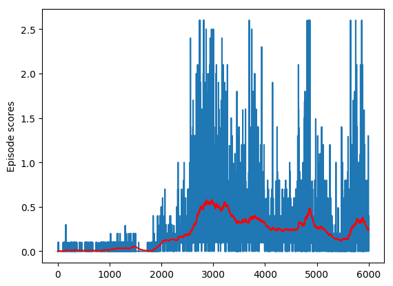

### Learning algorithm

Multi Aagent Deep deterministic policy gradient agent as described in
  https://arxiv.org/pdf/1706.02275.pdf.  The hyperparameters and implementation
closely follow the paper, with a sprinking of hyperparameters from an earlier Udacity
assignment.  There is a single, shared actor network and target for all agents.
There is a separate critic network/target per agent.

### Training

The following plots both the per episode score and the 100 episode moving
average:



The maximum 100 episode average achieved was 0.62 at episode 2912.

### Hyperparameters

```python
# Size of the replay buffer storing past experiences for training
REPLAY_BUFFER_SIZE = 10**6

# Number of experiences to use per training minibatch
BATCH_SIZE = 256

# Number of steps taken between each round of training.  Each agent
# action is considered a step (so 20 simultaneous agents acting mean 20 steps)
STEPS_BETWEEN_TRAINING = 1

# Reward decay
GAMMA = 0.99

# Learning rate for the actor network
ACTOR_LEARNING_RATE = 1e-2

# Learning rate for the critic network
CRITIC_LEARNING_RATE = 1e-2

# Rate at which target networks are updated
TAU = 1e-2

# Weight decay term used for training the critic network
CRITIC_WEIGHT_DECAY = 0.0000

# Random process parameters
RANDOM_THETA = 0.15
RANDOM_SIGMA = 0.2
```

### Ideas for future work

I found learning to be inconsistent, unstable, and slow.  I suspect part of this
is a fairly low incidence of positive examples, so I'd like to try a
prioritized recall buffer.  It would also be interesting to try the ensemble
of policies described in the paper, though I doubt this technique is that
relevant to this specific problem since there are only two agents.
